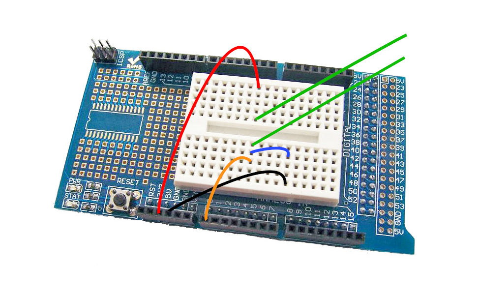

# kwh_monitor

A project to monitor and graph the electricity usage in the home over time.

## How it works

A long cable with a light sensitive
resistor runs from an Arduino into the outside electricity cabinet, the resistor
is positioned in front of the LED on the mains power meter. The LED pulses with varying
frequency according to the current consumption.  Some code on the arduino
(LightSensor.ino) detects the pulses, and announces them over the serial port.

Some code on the Raspberry Pi (kwh_monitor.py) 
listens on the serial connection, notes the pulse frequency and calculates
the effective kWh usage. It reports the value as a 'gauge' metric to a 
prometheus server running on the Raspberry Pi.

## Requirements

This project has only been built/tested with:
 - Raspberry Pi Model B rev 2 (armv6) with Raspian 10 "buster"
 - Arduino Mega, with arduino-cli
 - Python 3.7
 - Prometheus 2.38.0
 - Grafana

## Arduino sensor


Green lines are to the light sensitive resistor.  Blue is a resistor (value t.b.d).

## Install

Build kwh_monitor.py:
```
python3 -m venv .
. bin/activate
pip install -r requirements.txt
```
and start it up:
```
nohup ./kwh_monitor.py &
```

Download promemtheus armv6 binary from https://prometheus.io/download/ and unpack. Edit prometheus.yml to configure an additional scrape config:
```
scrape_configs:
  - job_name: "kwh_monitor"
    static_configs:
      - targets: ["localhost:8000"]
```
and startup prometheus:
```
nohup ./prometheus &
```

Install grafana:
```
wget -q -O - https://packages.grafana.com/gpg.key | sudo apt-key add -
echo "deb https://packages.grafana.com/oss/deb stable main" | sudo tee -a /etc/apt/sources.list.d/grafana.list
sudo apt-get update
sudo apt-get install -y grafana
sudo systemctl enable grafana-server
sudo systemctl start grafana-server
sudo apt clean
```

Download arduino-cli from https://github.com/arduino/arduino-cli/releases, unpack and add to $PATH.  Build and upload the arduino code:
```
buildUpload.sh
```

## Use

Visit prometheus at localhost:9090 and grafana at localhost:3000.  Configure a prometheus datasource, using the "kwh_gauge" metric.
